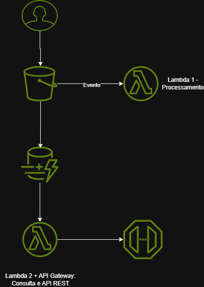

# Desafio: Execução de Tarefas com AWS Lambda e S3  

##  Objetivo  
Este desafio faz parte do **Bootcamp AWS Foundations**, com foco em entender a integração entre os serviços **S3, Lambda e DynamoDB**, aplicando o conceito de **Infraestrutura Serverless** na prática.

##  O que é o Amazon S3  
O **Amazon S3 (Simple Storage Service)** é um serviço de **armazenamento de objetos** altamente escalável e durável da AWS.  
Ele é usado para guardar arquivos como imagens, planilhas, logs e datasets, que ficam organizados em **buckets**.  

Além de armazenar, o S3 também pode **disparar eventos automáticos** para acionar outros serviços, como o AWS Lambda.  

>  É o ponto de entrada ideal para dados que precisam ser processados automaticamente.

##  O que é o AWS Lambda  
O **AWS Lambda** é um serviço de **computação sem servidor (serverless)**.  
Ele executa funções de código sob demanda — ou seja, o código é acionado por eventos, e a AWS gerencia toda a infraestrutura automaticamente.  

- Linguagens suportadas: Python, Node.js, Java, C#, entre outras.  
- Escalabilidade automática conforme a quantidade de eventos.  
- Pagamento apenas pelo tempo de execução.

>  Lambda é ideal para automação, processamento de dados e integrações entre serviços AWS.

---

##  Case Real: Sistema de Processamento de Notas Fiscais  

Este case mostra como a integração entre **S3 + Lambda + DynamoDB + API Gateway** pode automatizar um fluxo real de negócio.

###  Cenário: Upload e processamento automático

1️ **Upload de arquivo:** o usuário envia um `.csv` ou `.json` com notas fiscais para o **bucket S3**.  
2️ **Evento S3:** o upload dispara um evento que ativa uma **função Lambda (Python)**.  
3️ **Processamento:** a Lambda lê o arquivo, extrai os dados e grava na **tabela DynamoDB**.  
4️ **Consulta:** uma segunda Lambda consulta o DynamoDB e **exibe os dados via API Gateway**, criando uma API REST de leitura.  

---

###  Fluxo resumido

Essa arquitetura é **serverless**, ou seja, **sem servidores para gerenciar** — a AWS escala tudo automaticamente.

---

##  AWS Local com LocalStack  

O **LocalStack** é uma ferramenta que permite **simular os serviços da AWS localmente**.  
Ele é perfeito para desenvolvedores que querem testar integrações sem custos.  

###  Vantagens:
- Simula serviços como **S3, Lambda, DynamoDB e API Gateway**  
- Permite testar e depurar funções **offline**  
- Ideal para desenvolvimento e CI/CD sem precisar da nuvem real  

>  Com LocalStack, é possível testar todo o fluxo antes de fazer deploy na AWS.
##  Conclusão  

Este desafio mostrou o poder da **automação serverless** e como a combinação de **S3 + Lambda + DynamoDB + API Gateway** cria soluções modernas, seguras e escaláveis.  
A prática reforçou como a AWS facilita o desenvolvimento de pipelines de dados e aplicações reativas com o mínimo de infraestrutura.  

> “Infraestrutura serverless é sobre fazer mais com menos — mais automação, menos servidores.” ☁️  

---

##  Serviços AWS Utilizados  

| Serviço | Função |
|----------|--------|
| **Amazon S3** | Armazenamento e gatilho de eventos |
| **AWS Lambda** | Processamento e automação |
| **Amazon DynamoDB** | Banco de dados NoSQL para registrar dados |
| **Amazon API Gateway** | Exposição dos dados processados via API REST |
| **LocalStack** | Simulação local dos serviços AWS |
